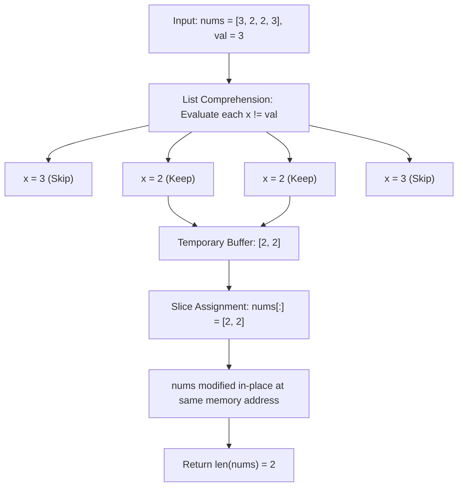

<h2><a href="https://leetcode.com/problems/remove-element">27. Remove Element</a></h2>

<p>Given an integer array <code>nums</code> and an integer <code>val</code>, remove all occurrences of <code>val</code> in <code>nums</code> <a href="https://en.wikipedia.org/wiki/In-place_algorithm" target="_blank"><strong>in-place</strong></a>. The order of the elements may be changed. Then return <em>the number of elements in </em><code>nums</code><em> which are not equal to </em><code>val</code>.</p>

<p>Consider the number of elements in <code>nums</code> which are not equal to <code>val</code> be <code>k</code>, to get accepted, you need to do the following things:</p>

<ul>
	<li>Change the array <code>nums</code> such that the first <code>k</code> elements of <code>nums</code> contain the elements which are not equal to <code>val</code>. The remaining elements of <code>nums</code> are not important as well as the size of <code>nums</code>.</li>
	<li>Return <code>k</code>.</li>
</ul>

<p><strong>Custom Judge:</strong></p>

<p>The judge will test your solution with the following code:</p>

<pre>int[] nums = [...]; // Input array
int val = ...; // Value to remove
int[] expectedNums = [...]; // The expected answer with correct length.
                            // It is sorted with no values equaling val.

int k = removeElement(nums, val); // Calls your implementation

assert k == expectedNums.length;
sort(nums, 0, k); // Sort the first k elements of nums
for (int i = 0; i &lt; actualLength; i++) {
    assert nums[i] == expectedNums[i];
}
</pre>

<p>If all assertions pass, then your solution will be <strong>accepted</strong>.</p>

<p>&nbsp;</p>
<p><strong class="example">Example 1:</strong></p>

<pre><strong>Input:</strong> nums = [3,2,2,3], val = 3
<strong>Output:</strong> 2, nums = [2,2,_,_]
<strong>Explanation:</strong> Your function should return k = 2, with the first two elements of nums being 2.
It does not matter what you leave beyond the returned k (hence they are underscores).
</pre>

<p><strong class="example">Example 2:</strong></p>

<pre><strong>Input:</strong> nums = [0,1,2,2,3,0,4,2], val = 2
<strong>Output:</strong> 5, nums = [0,1,4,0,3,_,_,_]
<strong>Explanation:</strong> Your function should return k = 5, with the first five elements of nums containing 0, 0, 1, 3, and 4.
Note that the five elements can be returned in any order.
It does not matter what you leave beyond the returned k (hence they are underscores).
</pre>

<p>&nbsp;</p>
<p><strong>Constraints:</strong></p>

<ul>
	<li><code>0 &lt;= nums.length &lt;= 100</code></li>
	<li><code>0 &lt;= nums[i] &lt;= 50</code></li>
	<li><code>0 &lt;= val &lt;= 100</code></li>
</ul>


---

# 🛍️ Remove-Element | Explained

## Approach 1: In-Place Slice Assignment with List Comprehension

### Intuition
Imagine you manage a grocery shelf and need to purge every damaged box of a specific item (`val`). Instead of shifting items one by one on the shelf while checking dates, you take an empty cart, scan the shelf from left to right, and load only the undamaged items into your cart. Once you finish scanning, you clear the shelf entirely and restock it with the items from your cart. 

In Python, setting `nums[:] = ...` behaves exactly like restocking that original shelf: it replaces the underlying elements of the existing list object rather than creating a new shelf (variable rebinding), satisfying the caller's reference check.

### Algorithm Visualized



### Approach
1. **Filter via List Comprehension**: Iterate across each item `x` in `nums`. If `x != val`, preserve it in an intermediate list buffer.
2. **In-Place Mutation via Slice Assignment**: Use the slice assignment operator `nums[:] = ...`. This modifies the existing list object in-place by replacing all its items with the items from the newly formed list, rather than rebinding the identifier `nums` to a new memory address.
3. **Return New Length**: Call `len(nums)` to return $k$, the count of elements that do not equal `val`.

### Detailed Code Analysis

```python
class Solution:
    def removeElement(self, nums: list[int], val: int) -> int:
        nums[:] = [x for x in nums if x != val]
        return len(nums)
```

- **`[x for x in nums if x != val]`**:
  This expression allocates an auxiliary list in memory. Python loops over `nums` at the C level, checks the condition `x != val` for each element, and appends valid items to the new list object.
  
- **`nums[:] = ...`**:
  The slice target `nums[:]` references the entire range of indices within the existing list instance. Instead of changing what object `nums` points to (which `nums = ...` would do, breaking the external caller's reference), Python clears the internal array buffer of the original list and repopulates it with the items from the comprehension. This guarantees the caller sees the modified array in-place.

- **`return len(nums)`**:
  After the slice assignment, the internal size descriptor of `nums` is updated to reflect the count of retained elements. Calling `len(nums)` operates in $O(1)$ time and returns the exact number of valid elements $k$.

### Code
```python
class Solution:
    def removeElement(self, nums: list[int], val: int) -> int:
        nums[:] = [x for x in nums if x != val]
        return len(nums)
```

### Complexity
- **Time Complexity:** $O(N)$. 
  - Iterating through `nums` of length $N$ to evaluate `x != val` takes $O(N)$ time.
  - Copying the remaining $K$ elements ($K \le N$) into the slice `nums[:]` takes $O(K)$ operations.
  - Overall time scales linearly: $O(N + K) = O(N)$.

- **Space Complexity:** $O(N)$ auxiliary space.
  - The list comprehension `[x for x in nums if x != val]` constructs a new temporary list in heap memory holding up to $N$ elements before copying them into `nums[:]`. 
  - *Engineering Note:* While this passes LeetCode because the original list reference is modified, it technically violates the strict $O(1)$ auxiliary space constraint often expected by interviewers for this problem.

---

## 🕵️‍♂️ Follow-up Questions

### 1. How can we optimize this to achieve true $O(1)$ auxiliary space?
To eliminate the temporary array allocation, use the **Two-Pointer (Reader/Writer)** approach. Maintain a `writer` index starting at `0`. Iterate through the array with a `reader` index. Whenever `nums[reader] != val`, write `nums[writer] = nums[reader]` and increment `writer`. At the end, `writer` represents the length $k$, achieved entirely in $O(1)$ extra space without creating new list objects.

### 2. What if elements equal to `val` are extremely rare?
If the target value occurs rarely (e.g., an array of 100,000 elements containing only two instances of `val`), standard left-to-right copying shifts almost all elements unnecessarily. You can optimize writes by swapping elements to remove with the last element of the array:
- When `nums[i] == val`, copy `nums[n - 1]` into `nums[i]` and decrement the effective array size `n`.
- If `nums[i] != val`, simply advance `i`.
This avoids shifting all non-matching elements and minimizes array writes to the number of elements actually removed.